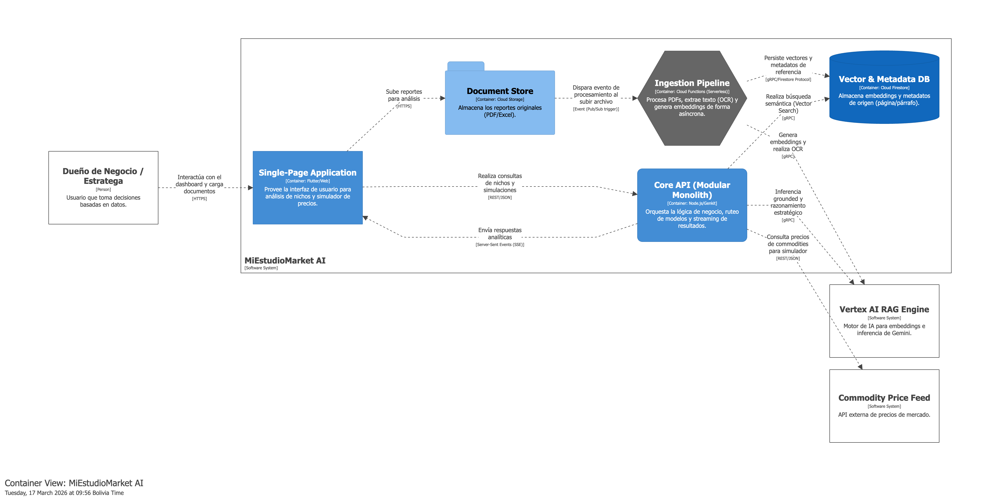

# MiEstudioMarket AI App

> De datos crudos a decisiones premium

App móvil agentica(agent) que transforma reportes globales masivos en estrategias de ejecución local para microempresarios, utilizando un motor RAG (Retrieval-Augmented Generation).

## Diagrama C4 (Estructura del proyecto)

En el siguiente diagrama se muestra la estructura del proyecto, donde se puede observar la interaccion entre los diferentes componentes del sistema.



## Project Structure (Monorepo)

```
├── miestudiomarket_ai_app/   # Flutter mobile/web app
│   └── lib/
│       ├── core/             # Theme, constants, utils
│       ├── features/         # Feature-first modules 
│       └── shared/           # Shared widgets and models
├── functions/                # Firebase Cloud Functions (TypeScript + Genkit)
│   └── src/
│       ├── index.ts          # Entry point + Genkit initialization
│       ├── types/            # Firestore document schemas
│       └── genkit/           # Genkit RAG flows
├── firebase.json             # Firebase unified configuration
├── firestore.rules           # Firestore security rules
└── storage.rules             # Cloud Storage security rules
```

## Tech Stack

| Layer | Technology |
|:------|:-----------|
| Frontend | Flutter (Material Design 3) |
| Backend | Node: Firebase Cloud Functions (TypeScript) |
| AI Orchestration | Firebase Genkit + Vertex AI (Gemini) |
| Database | Cloud Firestore (with Vector Search) |
| Storage | Firebase Cloud Storage |
| Security | Firebase App Check |

## Getting Started

### Prerequisites

- Flutter SDK 3.35+
- Node.js 20+
- Firebase CLI 15+

### Setup & Development

```bash
# 1. Install dependencies
# Flutter app
cd miestudiomarket_ai_app && flutter pub get

# Cloud Functions
cd ../functions && npm install

# 2. Local Build
npm run build
```

### Deployment

Para desplegar el proyecto completo o componentes específicos:

```bash

# Desplegar solo funciones
firebase deploy --only functions

# Desplegar índices de Firestore (requerido para búsquedas vectoriales)
#### de otra forma buscar en el log de cloud run suggestion de creacion de index
firebase deploy --only firestore:indexes
```

### App Flutter

El código fuente se localiza en el directorio app_example. Es imperativo generar las credenciales correspondientes en el archivo firebase_options.dart o, en su defecto, integrar los archivos de configuración nativos necesarios para la compatibilidad con las plataformas iOS y Android.


> [!NOTE]
> Si encuentras errores de índices en la consola de Firebase al realizar búsquedas, sigue el enlace proporcionado en el error para generar automáticamente el índice faltante.

## Documentation

- [Requirements](docs/requirements.md) — User stories and acceptance criteria
- [Design](docs/design.md) — Architecture, patterns, and quality attributes

Autor: [@paolojoaquinp](https://beacons.ai/paolojoaquinp)